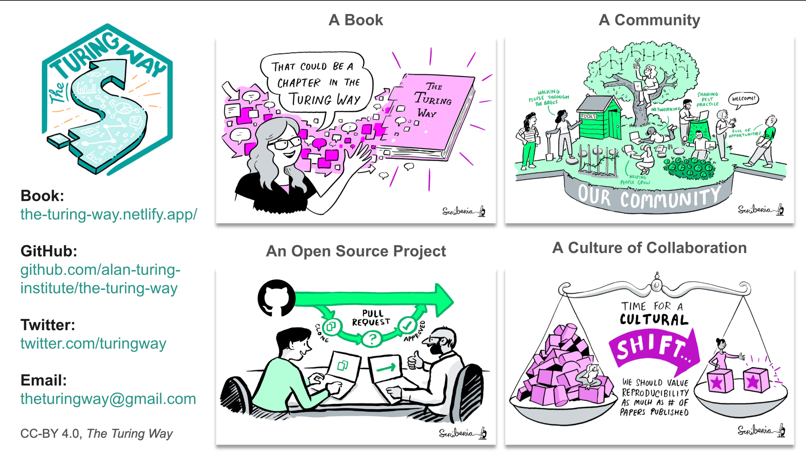
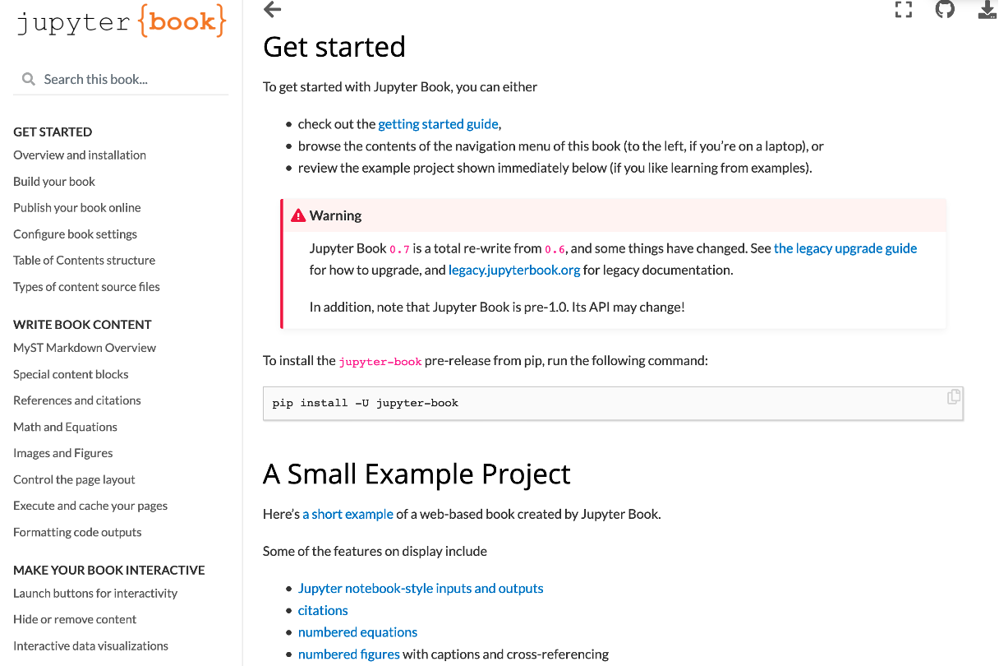
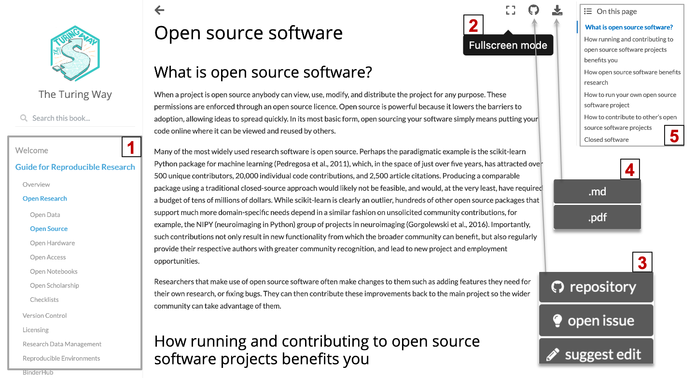

*Figures 1: One image description of The Turing Way*

## _The Turing Way_

📹 [Overview video: _The Turing Way_](https://www.youtube.com/watch?v=JyNhPfcBxTg&list=PLBxcQEfGu3Dmdo6oKg6o9V7Q_e7WSX-vu&index=2&ab_channel=TheTuringWayCommunity)
---

- **A book**:
  - [https://the-turing-way.netlify.com/](https://the-turing-way.netlify.com/)
- **An open source project**:
  - [https://github.com/alan-turing-institute/the-turing-way](https://github.com/alan-turing-institute/the-turing-way)
- **A community**:
  - Divrse researchers come together to collaborate and develop The Turing Way materials online via GitHub (see [Contributors Table](https://github.com/alan-turing-institute/the-turing-way#contributors))
- **A culture of collaboration**:
> *The Turing Way is an Open Source collaborative project that involves and supports its members of diverse skills and backgrounds to ensure that data science is accessible and useful for everyone.
Its moonshot goal is to make reproducible research 'too easy not to do'.*

**Reproducibility**

At The Turing Way we define reproducible research as work that can be independently recreated from the same data and the same code that the original team used.
Reproducible is distinct from replicable, robust and generalisable as described in the figure below.

*Figures 2: A result is reproducible when the same analysis steps performed on the same dataset consistently produces the same answer.*

**Community members sharing best practices for reproducible research**

_The Turing Way_ is a community-led book project that involves diverse perspectives of researchers, funders, educators, learners and various stakeholders from around the world.

Our goal is to provide a platform where these members can come together to share skills and resources that data scientists in academia, industry, government and other sectors need at the start of their projects to ensure that their projects are easy to reproduce and reuse at the end.

The book started as a guide for reproducibility, covering technical methods such as version control, testing, and continuous integration.
However, technical skills constitute only one aspect of reproducible research.
In February 2020, _The Turing Way_ expanded to a series of guides covering topics on reproducible research, project design, communication, collaboration, and ethical research.

To date, there are **100 subchapters, collaboratively written by over 175 contributors** and read by hundreds of researchers worldwide.

### References:

- [GitHub](https://github.com/alan-turing-institute/the-turing-way)
- [Contribution guideline](https://github.com/alan-turing-institute/the-turing-way/blob/master/CONTRIBUTING.md)

## JupyterBook

📹 [VIDEO](https://www.youtube.com/watch?v=PmxZywVwhP8&list=PLBxcQEfGu3Dmdo6oKg6o9V7Q_e7WSX-vu&index=3&ab_channel=TheTuringWayCommunity)
---

> Jupyter Book is an open source project for building beautiful, publication-quality books and documents from computational material.

Jupyter Book provides the following features for creating online books:

**Publication-quality content in markdown files**

- Files can be written in Markdown syntax
- Jupyter Book also proves an extended flavor of markdown with publishing features that allows citations and cross-references, math and equations, and figures that can be resized.

**Interactive and executable codes in Jupyter Notebooks**

- Chapters can be written in Jupyter Notebooks, which can include code that can be executed while building the book, outputs for which can be displayed in-line in your book.
- The Jupyter visualisation can allow readers to interact with the file content.

**Navigable and collaborative workflow**

- Jupyter Books are easy to navigate (see demo in the section).
- The GitHub configuration allows readers to collaborate easily by suggeting edits and reporting bugs.

*Figure 3: Jupyter Book offers a detailed guide for creating different types of book contents*

**The guide for using Jupyter Book is written in online Jupyter Book: [https://jupyterbook.org/intro.html](https://jupyterbook.org/intro.html)**.
It provides guidelines with example projects that one can play with to create a different types of book content and test its features.

### References

- [GitHub](https://github.com/executablebooks/jupyter-book)
- [Contribution guideline](https://jupyterbook.org/contribute/intro.html)

## Project Demos

> ## Setting to explore the Jupyter Book of _The Turing Way_
>
> Jupyter Book is used for creating the online book of _The Turing Way_.
> ***Please use this link to follow the book demo: [https://the-turing-way.netlify.app/welcome](https://the-turing-way.netlify.app/welcome)***
> In this demo we show you the following aspects of online book of _The Turing Way_:
>
> ### 5 guides in _The Turing Way_
>
> - [Reproducible Research](https://the-turing-way.netlify.app/reproducible-research)
> - [Project Design](https://the-turing-way.netlify.app/project-design)
> - [Communication](https://the-turing-way.netlify.app/communication)
> - [Collaboration](https://the-turing-way.netlify.app/collaboration)
> - [Ethical Research](https://the-turing-way.netlify.app/ethical-research)
>
> ### _The Turing Way_ Community Handbook
>
> _The Turing Way_ [Community Handbook](https://the-turing-way.netlify.app/community-handbook) aims to provide information about the project, ways of working, and other aspects that can make community participation equitable for our members.
{: .challenge}

### Navigable and collaborative features of Jupyter Book

*Figure 4: Jupyter Book feature makes _The Turing Way_ navigable and collaborative.*

Users of Jupyter Book can not only read the chapters online, but can easily navigate its file and collaborate in the project.

- As shown in the Figure 4, Jupyter Book creates a table of content for the book in the left (Figure 4.1) and table of content for the chapter for the chapter on the right (Figure 4.5), making the book and chapter contents easy to navigate.
- The book has been configured to allow a reader to read the book in the fullscreen mode (Figure 4.2).
- The collaborative workflow has been explained in the Module-7 of this tutorial.

### _The Turing Way_ GitHub repository

We welcome all contributions to this project via issues and pull requests on outr online [GitHub repository](https://github.com/alan-turing-institute/the-turing-way).
We have a [contributors guideline](https://github.com/alan-turing-institute/the-turing-way/blob/master/CONTRIBUTING.md) that allows our contributors to make sure that their contributions can be easily integrated into the projects.

> ## Important components for building Jupyter Book of _The Turing Way_
>
> All the content of the book is stored in the [`book/website` folder](https://github.com/alan-turing-institute/the-turing-way/tree/master/book/website).
> Please take a moment to check out these files - you don't need to read them all, but take note of where they are and what their format is:
>
> 1. Chapters contents written in `Markdown`
> 2. The `_toc.yml file` to structure the book by defining the table of content
> 3. A directory to store all the figures (`figures`)
> 4. A bibtex file to store all the references (`references.bib`)
> 5. The `_config.yml` file for configuring the book
{: .callout}

In the later modules, we will learn about creating a Jupyter Book from scratch using these important components of the book.
We will also see how one can cite an external resources through `references.bib file` and cross reference chapters within the JupyterBook.


